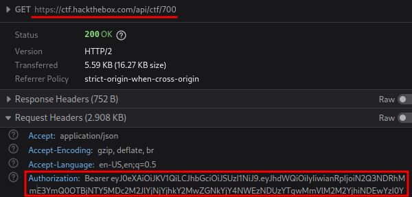

# CTFScrapper

*Read this in other languages: [Español](README.md), [English](README.en.md).*

This project was created to gather challenges available around CTFs, it generates a local workspace with the CTF files and it creates a `README.md` and filled with challenge available information.

## Table of Contents

- [Installation](#installation)
- [Usage](#usage)
  - [CTFd](#ctfd)
    - [With protection scenario](#with-protection-scenario)
  - [HTB CTF](#htb-ctf)
  - [Result](#result)
- [Support](#support)
- [Contributing](#contributing)
  - [TODOS](#todos)

## Installation

```bash
git clone https://github.com/srrequiem/CTFScrapper.git
cd CTFScrapper
pip install -r requirements.txt
```

## Usage

```bash
python ctfscrapper.py <url|ctf_id> <username> <password>

python ctfscrapper.py <url|ctf_id> -t <token>
```

Currently only CTFs under this platforms are supported:

- [CTFd](https://ctfd.io/)
- [HTB CTF](https://ctf.hackthebox.com/)

### CTFd

```bash
python ctfscrapper.py <url>

# Example
python ctfscrapper.py https://demo.ctfd.io
Username: srrequiem
Password:
```

#### With protection scenario

In some cases platform is setup with CAPTCHA protection, at this time if it is the case, the tool will print an authentication error and will ask for platform session cookie.

```bash
python ctfscrapper.py https://demo.ctfd.io
Username: srrequiem
Password:

[!] Authentication failure
Session: ced668a9...
```

### HTB CTF

Once signed up at the event, is necessary to get event `id` and the `Bearer token` and use it in the script.

Event ID:

https://ctf.hackthebox.com/event/700 &rarr; ID = 700

Bearer token:

After accessing the event you should be able to search a hackthebox api request `https://ctf.hackthebox.com/api/ctf/700` and identify the `Authorization` header with `Bearer token` value in it.



```bash
python ctfscrapper.py <ctf_id>

# Example
python ctfscrapper.py 700
Bearer token: eyJ0...
```

### Result

Script execution will produce `CTFS` folder and inside it a folder with the CTF name, files and all the information gathered following this structure:

```text
CTFS
└── 20221022_htb_hack_the_boo
    ├── files
    │   ├── crypto_challenge.zip
    │   └── web_challenge.zip
    └── README.md
```

Inside `README.md` you will find challege information using this template:

```markdown
# CTF Name

## Web

### Web Reto 1

#### Stats

| Attribute | Info |
|---|---|
| Description | - |
| Files | - |

#### Solution

## Crypto

### Crypto Reto 1

#### Stats

| Attribute | Info |
|---|---|
| Description | - |
| Files | - |

#### Solution

## Reversing

### Reversing Reto 1

#### Stats

| Attribute | Info |
|---|---|
| Description | - |
| Files | - |

#### Solution

## Pwning

### Pwning Reto 1

#### Stats

| Attribute | Info |
|---|---|
| Description | - |
| Files | - |

#### Solution

## Forense

### Forense Reto 1

#### Stats

| Attribute | Info |
|---|---|
| Description | - |
| Files | - |

#### Solution

```

## Support

Please [open an issue](https://github.com/srrequiem/CTFScrapper/issues/new) for support.

## Contributing

If you have identifed any type of error you can either [open an issue](https://github.com/srrequiem/CTFScrapper/issues/new) or follow the "fork-and-pull" Git workflow to make corrections or add new features.

1. **Fork** the repo on GitHub
2. **Clone** the project to your own machine
3. **Commit** changes to your own branch
4. **Push** your work back up to your fork
5. Submit a **Pull request** so that we can review your changes

NOTE: Be sure to merge the latest from "upstream" before making a pull request!

### TODOS

- Add hints to markdown file (ctfd type).
- Markdown challenge template.
- Improve code structure (public, private functions).
- Evaluate possibilty to add threads.
- Retrieve execution process info to user.
