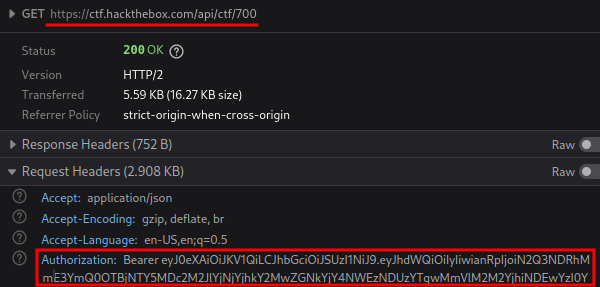

# CTFScrapper

*Read this in other languages: [Español](README.md), [English](README.en.md).*

Proyecto creado con la intención de recopilar los retos presentados en los CTFs mediante la generación de un ambiente de trabajo local con los archivos y la creación de un `README.md` con la información disponible de los retos.

## Tabla de Contenidos

- [Instalación](#instalación)
- [Uso](#uso)
  - [CTFd](#ctfd)
    - [Escenario con protecciones](#escenario-con-protecciones)
  - [HTB CTF](#htb-ctf)
  - [Resultado](#resultado)
- [Soporte](#soporte)
- [Contribuciones](#contribuciones)
  - [TODOS](#todos)

## Instalación

```bash
git clone https://github.com/srrequiem/CTFScrapper.git
cd CTFScrapper
pip install -r requirements.txt
```

## Uso

```bash
python ctfscrapper.py <url|ctf_id> <username> <password>

python ctfscrapper.py <url|ctf_id> -t <token>
```

Actualmente son soportadas las siguientes plataformas que hostean CTFs:

- [CTFd](https://ctfd.io/)
- [HTB CTF](https://ctf.hackthebox.com/)

### CTFd

```bash
python ctfscrapper.py <url>

# Ejemplo
python ctfscrapper.py https://demo.ctfd.io
Username: srrequiem
Password:
```

#### Escenario con protecciones

En algunas ocasiones suelen configurar un token de CAPTCHA por lo que al momento, si es el caso, la herramienta mandará un mensaje de fallo de autenticación y solicitará el valor de la cookie de sesión de la plataforma.

```bash
python ctfscrapper.py https://demo.ctfd.io
Username: srrequiem
Password:

[!] Authentication failure
Session: ced668a9...
```

### HTB CTF

Una vez realizado el registro del evento en la plataforma, es necesario obtener el `id` y el `Bearer Token` para proporcionarlo al script.

Obtención de ID:

https://ctf.hackthebox.com/event/700 &rarr; ID = 700

Obtención de Bearer:

Al entrar al evento buscar la request que mande a llamar la api de hackthebox `https://ctf.hackthebox.com/api/ctf/700` y extraer el `Bearer token` del header de `Authorization`.



```bash
python ctfscrapper.py <ctf_id>

# Ejemplo
python ctfscrapper.py 700
Bearer token: eyJ0...
```

### Resultado

La ejecución del script generará la carpeta `CTFS` dentro del directorio del proyecto y dentro de esta la carpeta del CTF que se haya descargado, teniendo como resultado la siguiente estructura:

```text
CTFS
└── 20221022_htb_hack_the_boo
    ├── files
    │   ├── crypto_challenge.zip
    │   └── web_challenge.zip
    └── README.md
```

Dentro del `README.md` se podrá encontrar la información de los retos bajo el template:

```markdown
# Nombre CTF

## Web

### Web Reto 1

#### Stats

| Attribute | Info |
|---|---|
| Description | - |
| Files | - |

#### Solution

## Crypto

### Crypto Reto 1

#### Stats

| Attribute | Info |
|---|---|
| Description | - |
| Files | - |

#### Solution

## Reversing

### Reversing Reto 1

#### Stats

| Attribute | Info |
|---|---|
| Description | - |
| Files | - |

#### Solution

## Pwning

### Pwning Reto 1

#### Stats

| Attribute | Info |
|---|---|
| Description | - |
| Files | - |

#### Solution

## Forense

### Forense Reto 1

#### Stats

| Attribute | Info |
|---|---|
| Description | - |
| Files | - |

#### Solution

```

## Soporte

Por favor [abre un issue](https://github.com/srrequiem/CTFScrapper/issues/new) para obtener soporte.

## Contribuciones

Si has identificado un error de cualquier tipo puedes [abrir un issue](https://github.com/srrequiem/CTFScrapper/issues/new) o seguir los siguientes lineamientos para realizar las correcciones y/o añadir nuevas características:

1. Realizar un **Fork** del repo en GitHub.
2. **Clonar** el proyecto en tu máquina.
3. Hacer **Commit** de los cambios en tu propia rama.
4. Hacer **Push** de tu modificación en el fork que hayas realizado.
5. Enviar un **Pull request** para revisar e integrar tus cambios.

NOTA: Asegúrate de haber integrado los últimos cambios que se encuentren en la rama remota antes de realizar un pull request.

### TODOS

- Add hints to markdown file (ctfd type).
- Markdown challenge template.
- Improve code structure (public, private functions).
- Evaluate possibilty to add threads.
- Retrieve execution process info to user.
